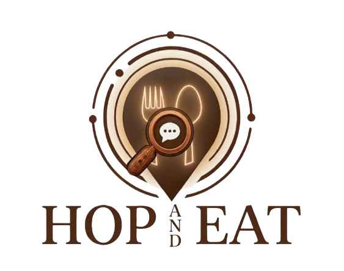

<!DOCTYPE html>
<html lang="es">
<head>
  <meta charset="UTF-8">
  <meta name="viewport" content="width=device-width, initial-scale=1.0">
  <meta name="description" content="Hop&Eat — Encuentra los mejores restaurantes y bares cerca de ti. Disponible en iOS y Android.">
  <meta property="og:title" content="Hop&Eat — Encuentra dónde comer">
  <meta property="og:description" content="Descubre restaurantes y bares cercanos, lee reseñas con IA y comparte tus favoritos.">
  <meta property="og:image" content="https://hopandeat.app/og-image.png">
  <title>Hop&Eat — Encuentra dónde comer</title>
  
</head>
<body>

  <!-- HERO -->
  <section class="hero">
    
    <h1>Hop&Eat</h1>
    
Encuentra los mejores restaurantes y bares cerca de ti. Con reseñas reales, resúmenes de IA y mucho más.

    

      
      
    

    
↓ Descubre más

  </section>

  <!-- FEATURES -->
  <section class="features">
    
Funcionalidades

    <h2>Todo lo que necesitas para salir a comer</h2>
    
Hop&Eat combina datos reales de Google Places con inteligencia artificial para darte la mejor experiencia.

    

      

        
📍

        <h3>Cerca de ti</h3>
        
Detecta tu ubicación automáticamente y muestra los mejores sitios en segundos.

      

      

        
⭐

        <h3>Reseñas reales</h3>
        
Valoraciones y reseñas reales de Google Places, siempre actualizadas.

      

      

        
✨

        <h3>Resumen IA PRO</h3>
        
Inteligencia artificial analiza las reseñas y te da un resumen claro de lo mejor y lo peor.

      

      

        
❤️

        <h3>Favoritos PRO</h3>
        
Guarda tus sitios favoritos y crea listas personalizadas para cada ocasión.

      

      

        
🔍

        <h3>Filtros avanzados PRO</h3>
        
Filtra por tipo de cocina, precio, valoración mínima y radio de búsqueda.

      

      

        
📱

        <h3>Compartir</h3>
        
Comparte restaurantes por WhatsApp con un solo toque.

      

    

  </section>

  <!-- PRICING -->
  <section class="pricing">
    
Precios

    <h2>Simple y transparente</h2>
    
Empieza gratis y desbloquea todo con Premium por menos de 1€ al mes.

    

      

        
Gratuito

        
0€

        
Para siempre

        <ul>
          <li>5 restaurantes por búsqueda</li>
          <li>2 reseñas por sitio</li>
          <li>Radio de 1 km</li>
          <li>Compartir básico</li>
        </ul>
        <a href="#" class="plan-cta">Descargar gratis</a>
      

      

        
⭐ Premium Anual

        
9,99€/año

        
Menos de 1€ al mes · Ahorra un 58%

        <ul>
          <li>Resultados ilimitados</li>
          <li>Resumen IA de reseñas</li>
          <li>Filtros avanzados</li>
          <li>Favoritos y listas</li>
          <li>Radio hasta 5 km</li>
          <li>Alertas de ofertas</li>
        </ul>
        <a href="#" class="plan-cta">Activar Premium</a>
      

      

        
Premium Mensual

        
1,99€/mes

        
&nbsp;

        <ul>
          <li>Todo lo de Premium anual</li>
          <li>Cancela cuando quieras</li>
        </ul>
        <a href="#" class="plan-cta">Empezar ahora</a>
      

    

  </section>

  <!-- FOOTER -->
  <footer>
    
🍺 Hop&Eat

    
Encuentra dónde comer, ahora mismo.

    

      <a href="/privacy.html">Política de Privacidad</a>
      <a href="/terms.html">Términos y Condiciones</a>
      <a href="mailto:support@hopandeat.app">Contacto</a>
    

    
© 2026 Hop&Eat · España

  </footer>

</body>
</html>
